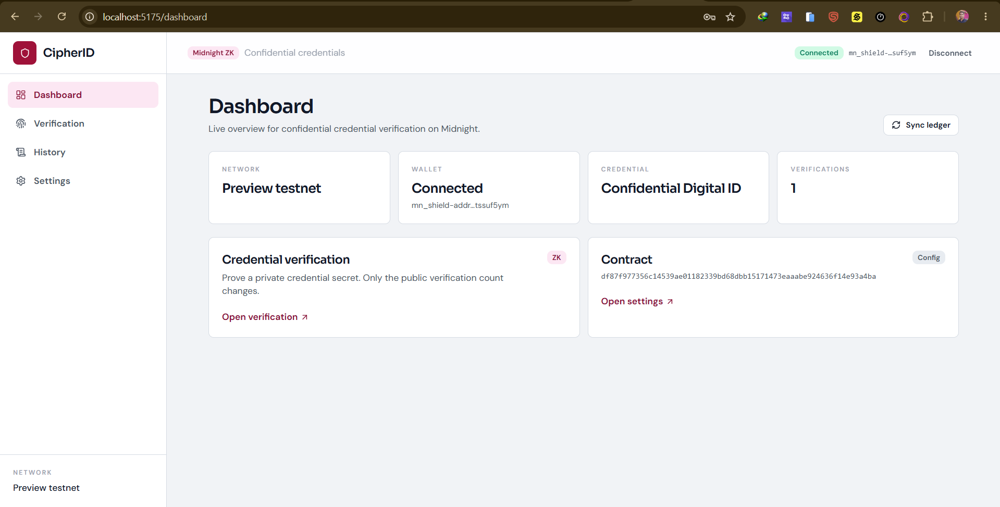
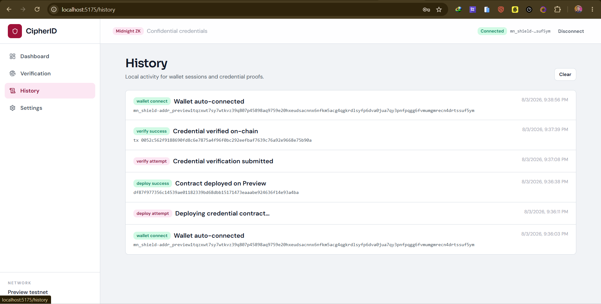
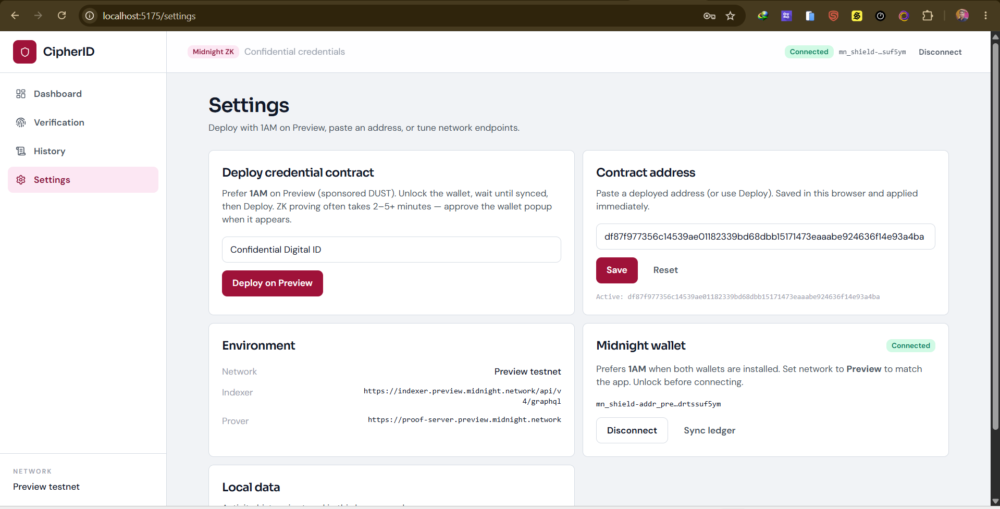

# CipherID — Confidential Digital ID on Midnight

A **Midnight** DApp where users prove they hold a valid digital identity credential **without revealing their identity or private credential secret**. The public ledger shows only the **credential name** and a running **verification count**.

[](https://github.com/leo-das-pixel/confidential-digital-id/actions/workflows/ci.yml)
[](https://confidential-digital-id.netlify.app/)
[](https://youtu.be/ScmZN5f9Eik)
[](docs/PREVIEW_STATUS.md)
[](https://midnight.network)
[](PROPOSAL.md)
[](https://nodejs.org)

<p>
  <a href="https://confidential-digital-id.netlify.app/"></a>
  <a href="https://youtu.be/ScmZN5f9Eik"></a>
  <a href="https://preview.midnightexplorer.com/contracts/0xdf87f977356c14539ae01182339bd68dbb15171473eaaabe924636f14e93a4ba"></a>
  <a href="https://github.com/leo-das-pixel/confidential-digital-id/actions/workflows/ci.yml"></a>
</p>

---

## Live Demo & Deployment

| Resource | Link / value |
| --- | --- |
| **Live Web Application** | [https://confidential-digital-id.netlify.app/](https://confidential-digital-id.netlify.app/) |
| **Local App UI** | [http://localhost:5175/](http://localhost:5175/) (`npm run dev:preview`) |
| **Preview Compact Contract** | `df87f977356c14539ae01182339bd68dbb15171473eaaabe924636f14e93a4ba` |
| **Explorer** | [Preview contract](https://preview.midnightexplorer.com/contracts/0xdf87f977356c14539ae01182339bd68dbb15171473eaaabe924636f14e93a4ba) |
| **Preprod Compact Contract (historical)** | `373815d6936cadddb6f5a89438ed6c72964793da23452149b1ec3c3a5f7b49f8` |
| **Sample verify tx (Preprod historical)** | `0001334e8e879bb892abe4407d16abcebdf9e1eb29d150029c56c9abeac6c28fec` |
| **Demo Video** | [https://youtu.be/ScmZN5f9Eik](https://youtu.be/ScmZN5f9Eik) |
| **GitHub** | [leo-das-pixel/confidential-digital-id](https://github.com/leo-das-pixel/confidential-digital-id) |
| **Product Proposal** | [PROPOSAL.md](PROPOSAL.md) |
| **Preview notes** | [docs/PREVIEW_STATUS.md](docs/PREVIEW_STATUS.md) |
| **Preprod notes (historical)** | [docs/PREPROD_STATUS.md](docs/PREPROD_STATUS.md) |

**Verified on Midnight Preview:** contract **deployed** via **1AM**. Prefer **Settings → paste** the Preview address below (faster than re-deploying). Preprod address is historical only.

**Preview contract:** `df87f977356c14539ae01182339bd68dbb15171473eaaabe924636f14e93a4ba`

---

## Screenshots & UI Showcase

### 1. Landing
Product entry for confidential credentials on Midnight Preview.


### 2. Dashboard
Network badge, wallet status, public `credentialName`, and live `verificationCount`.



### 3. Verification
Private credential secret witness → ZK prove → on-chain count increment.


### 4. History
Local browser activity trail for connect, deploy, and verify actions.



### 5. Settings
1AM **Deploy on Preview**, paste/save contract address, and indexer / prover URIs.



---

## Product Proposal & Category

- **Category**: `Confidential Credentials` (Rise-In Level 3)
- **Problem**: Verifying identity usually forces users to disclose PII (name, ID number, credential secret) to third parties.
- **Solution**: CipherID submits a Midnight transaction that **witnesses** a private credential secret inside a ZK circuit. The ledger verifies the proof without storing or revealing the secret.

Full write-up: [PROPOSAL.md](PROPOSAL.md)

---

## Privacy Model & On-Chain vs Private State

| An observer CAN see | An observer CANNOT see |
| --- | --- |
| The `credentialName` (set publicly at deploy) | The private credential secret or ID code |
| The total `verificationCount` | Who verified (no address stored on the credential ledger) |
| That a verification transaction occurred | Any link between a verification and a specific person |
| That the ZK proof is valid | The witness data used to build the proof |

Enforced in [`contract/src/hello-world.compact`](contract/src/hello-world.compact):

- `credentialName` is written with `disclose(name)` — intentionally public
- `secret` is an `Opaque<"string">` circuit input — **never** disclosed, **never** stored
- `verificationCount` only increments an aggregate counter

> Network-level fee metadata still exists for any wallet tx. The **contract** reveals nothing about identity or the secret.

---

## System Requirements & Prerequisites

- **Node.js** 22+
- **npm** 10+
- **Docker** — optional local proof server on port **6300** (Vite/Netlify can proxy remote Preview proof server)
- **Compact** `compactc` 0.31.x
- **Wallet**: [1AM](https://1am.xyz/) on **Preview** (same funded wallet is fine) and/or [Lace](https://chromewebstore.google.com/detail/lace/gafhhkghbfjjkeiendhlofajokpaflmk)

---

## Quick Start & Installation

```bash
git clone https://github.com/leo-das-pixel/confidential-digital-id.git
cd confidential-digital-id
npm install
npm run compile
```

### Preview UI (fastest — use 1AM)

```bash
npm run proof-server:preview   # optional
npm run dev:preview
```

Open the printed local URL (often `http://localhost:5175/`).

1. Unlock **1AM** → network **Preview** → wait until **synced**.
2. App prefers **1AM** when both wallets are installed.
3. Prefer **Settings → paste** the published Preview address below (faster than Deploy).
4. **Verify** with any secret; public `verificationCount` increments (ZK prove often 2–5+ minutes).

**Published Preview address:**

`df87f977356c14539ae01182339bd68dbb15171473eaaabe924636f14e93a4ba`

Faucet: [https://faucet.preview.midnight.network/](https://faucet.preview.midnight.network/)

### Environment (`cipherid-ui/.env.preview`)

| Variable | Purpose |
| --- | --- |
| `VITE_NETWORK_ID` | Must be `preview` (mismatch vs wallet breaks connect) |
| `VITE_CONTRACT_ADDRESS` | Published Preview hex above |
| `VITE_INDEXER_URI` | Preview indexer GraphQL |
| `VITE_INDEXER_WS_URI` | Preview indexer websocket |
| `VITE_PROOF_SERVER_URL` | Remote Preview proof server (rewritten to `/proof-server` proxy) |

### Local undeployed (optional)

```bash
docker compose up -d --wait
npm run setup
npm run cli
npm run dev
```

---

## Preview / Preprod Deployment Status

| Item | Status |
| --- | --- |
| **Netlify production** | [confidential-digital-id.netlify.app](https://confidential-digital-id.netlify.app/) |
| **Preview contract** | `df87f977356c14539ae01182339bd68dbb15171473eaaabe924636f14e93a4ba` |
| **Browser deploy path** | ✅ Verified with **1AM** (Preview) |
| **Preprod contract (historical)** | `373815d6936cadddb6f5a89438ed6c72964793da23452149b1ec3c3a5f7b49f8` |
| **Proof server (Netlify)** | Same-origin proxy `/proof-server/*` → Preview proof server (`public/_redirects` + `netlify.toml`) |
| **Tests + CI** | ✅ |

### Netlify production env (baked at build)

```
VITE_NETWORK_ID=preview
VITE_CONTRACT_ADDRESS=df87f977356c14539ae01182339bd68dbb15171473eaaabe924636f14e93a4ba
VITE_INDEXER_URI=https://indexer.preview.midnight.network/api/v4/graphql
VITE_INDEXER_WS_URI=wss://indexer.preview.midnight.network/api/v4/graphql/ws
VITE_PROOF_SERVER_URL=https://confidential-digital-id.netlify.app/proof-server
```

Do **not** point the live site at the bare remote proof host — browsers hit CORS. Use the `/proof-server` proxy.

---

## Circuits

| Circuit | Does | Discloses |
| --- | --- | --- |
| constructor `name` | Sets public credential label | `credentialName` |
| `verifyCredential(secret)` | Proves secret knowledge; increments counter | Only that a valid proof ran |

---

## Continuous Integration

[`.github/workflows/ci.yml`](.github/workflows/ci.yml) — install, compile checks, tests, UI build.

---

## Submission Checklist

### Level 1 — Contract & local deploy
- [x] Compact contract compiles
- [x] Public ledger: `credentialName`, `verificationCount`
- [x] `verifyCredential` takes a private `Opaque` secret
- [x] `disclose()` only for intentional public name
- [x] Local deploy + CLI

### Level 2 — Frontend & wallet
- [x] Web UI with wallet connect (prefers **1AM**)
- [x] Browser **Deploy** + **Verify**
- [x] Network / contract from env + Settings override
- [x] Public state panel + history
- [x] Live Netlify demo (update Netlify env to Preview)
- [x] Real **Preview** address published (`df87f977…4e93a4ba` via 1AM)
- [x] Demo video linked

---

## Available scripts

| Script | Description |
| --- | --- |
| `npm run compile` | Compile Compact → managed ZK artifacts |
| `npm test` | Unit tests |
| `npm run setup` | Local stack + deploy |
| `npm run deploy` | CLI deploy |
| `npm run cli` | Verify / read state |
| `npm run proof-server:preview` | Proof server only (`:6300`) |
| `npm run dev:preview` | UI with `.env.preview` |
| `npm run proof-server:preprod` / `dev:preprod` | Legacy Preprod path |
| `npm run dev` | UI (default / local env) |
| `npm run build` | Production UI build |

## Project structure

```
confidential-digital-id/
├── contract/                 # Compact + managed ZK artifacts
├── api/
├── cipherid-cli/
├── cipherid-ui/              # Vite + React (Deploy / Verify / Settings)
│   └── public/_redirects     # Netlify proof-server proxy + SPA
├── docs/PREPROD_STATUS.md
├── proof-server-local.yml
├── netlify.toml
├── docker-compose.yml
├── PROPOSAL.md
└── README.md
```
