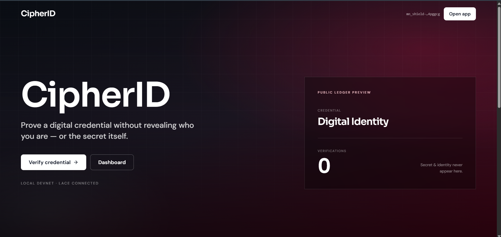
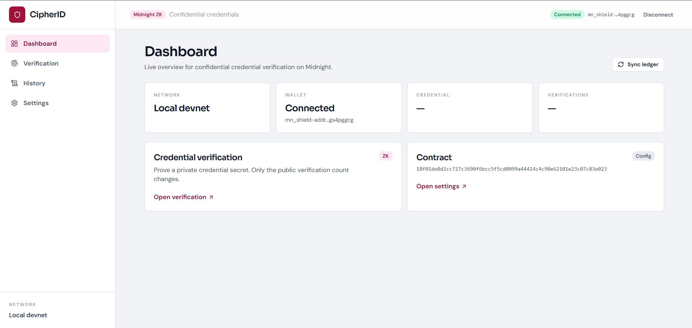
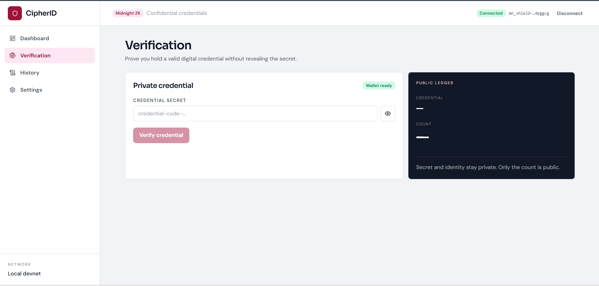
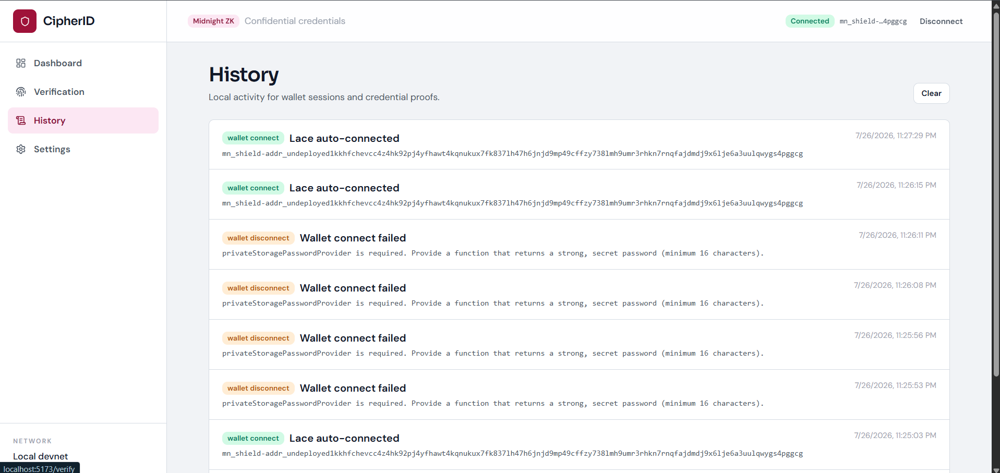
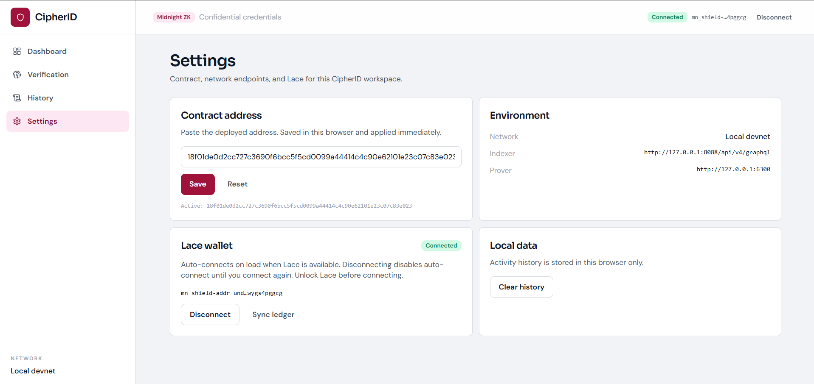

# Confidential Digital ID

A **Midnight** DApp where users prove they hold a valid digital identity credential **without revealing their identity or private credential secret**. The public ledger shows only the **credential name** and a running **verification count**.

- **Level 1** — Compact contract + local deploy + CLI ✅
- **Level 2** — Web frontend with Lace wallet connect + `verifyCredential` circuit call ✅
- **Level 3** — Tests, CI, privacy model, product proposal, submission checklist ✅

### Screenshots











---

## Product Proposal

**Category: Confidential Credentials**

> A user proves they hold a valid digital identity credential code without revealing sensitive personal details (full name, birthdate, ID number, or credential secret) publicly.

Verifying identity or holding specific credentials often requires users to disclose sensitive personally identifiable information (PII). This information is typically collected and stored by third parties, creating massive security risks and data-breach liabilities.

With **Confidential Digital ID**, users submit a Midnight transaction that **witnesses** their private credential secret inside a zero-knowledge circuit. The blockchain ledger verifies the cryptographic proof without storing or revealing the user's private data.

This is a reusable building block for **confidential credential verification**: age verification, membership authorization, privacy-preserving KYC, and gated digital access.

---

## Privacy Model

What an on-chain observer (indexer, explorer, validator) **can** and **cannot** learn:

| An observer CAN see | An observer CANNOT see |
| --- | --- |
| The `credentialName` (set publicly at deploy) | The private credential secret or ID code |
| The total `verificationCount` | Who verified their credential (no address stored) |
| That a verification transaction occurred | Any link between a verification and a specific person |
| The ZK proof is valid | The witness data used to build the proof |

How it is enforced in `contracts/hello-world.compact`:

- `credentialName` is written with `disclose(name)` — it is **intentionally** public.
- `secret` is an `Opaque<"string">` **circuit input** used only inside the `verifyCredential` proof. It is **never** passed to `disclose()` and is **never** stored in a ledger field.
- `verificationCount` is a `Counter`; `verifyCredential` only increments the counter, revealing an aggregate — not an identity.

> Note on unlinkability: like any transaction, a verification proof is submitted from a wallet that pays fees, so network-level metadata still exists. The **contract** reveals nothing about identity or the secret; the privacy guarantee is enforced at the ledger and state level.

---

## Public state vs private witness

| Layer | What | Visibility |
| --- | --- | --- |
| **Public ledger** | `credentialName`, `verificationCount` | Anyone can read via the indexer |
| **Private witness** | `secret` (`Opaque<"string">` circuit input) | Used only inside the `verifyCredential` proof; never disclosed, never stored |

---

## Requirements

- Node **22+**
- Docker (Compose v2) — for the local devnet + proof server
- Compact compiler

On WSL, work from the native Linux filesystem (e.g. `~/midnight-projects/...`) or map correctly to Windows.

## Install

```bash
npm install            # backend (contract, deploy, CLI, tests)
cd frontend && npm install # frontend (Vite + React)
```

## Compile

```bash
npm run compile
```

Runs `compact compile contracts/hello-world.compact contracts/managed/hello-world`. Output lands in `contracts/managed/hello-world/` (JS bindings, ZKIR, keys, circuit metadata).

## Test

```bash
npm test
```

Runs the test suite in `scripts/tests.ts` (network resolution, state round-trip, and compiled-artifact privacy invariants).

## Local deploy

One-shot (starts local node + indexer + proof-server, compiles, deploys):

```bash
npm run setup
```

Or step by step:

```bash
docker compose up -d --wait
npm run compile
npm run deploy
```

Deploy writes the contract address to `.midnight-state.json` under `deployments.undeployed`. Interact via the CLI:

```bash
npm run cli
```

- **Option 1** — submit a private credential verification proof
- **Option 2** — read public `credentialName` and `verificationCount`

Smoke-test the deployment:

```bash
npm run test:e2e
```

### Local devnet ports

| Service | Port | Role |
| --- | --- | --- |
| node | 9944 | Midnight `dev` chain |
| indexer | 8088 | GraphQL public state |
| proof-server | 6300 | ZK proof generation |

Tear down: `docker compose down -v`.

---

## Frontend (Level 2)

A Vite + React + TypeScript full-screen SaaS app in [`frontend/`](./frontend) that connects the **Lace (Midnight)** wallet and calls the `verifyCredential` circuit.

Features:
- **Full-bleed SaaS Landing Page (`/`)**: Dark-mode marketing view showcasing zero-knowledge proof mechanics, active network status, and product architecture.
- **Structured App Shell**: Full-screen SaaS console with navigation across **Dashboard**, **Verify**, **History**, and **Settings**.
- **Lace Wallet Integration**: Real-time wallet connection, address display, sync state, and network status widget powered by `wallet-context.tsx`.
- **Zero-Knowledge Verification (`/verify`)**: Circuit execution for confidential credentials with step-by-step state tracking (initiating, proving, submitting, complete).
- **Public Ledger State (`/dashboard`, `/history`)**: Real-time tracking of public `credentialName` and aggregate `verificationCount`.
- **Verification History & Settings (`/history`, `/settings`)**: Interactive audit history log and configurable network settings.

### Run the frontend locally

From the project root:

```bash
npm run dev       # Launches frontend at http://localhost:5173
```

Or from `frontend/`:

```bash
cd frontend
npm run dev
```

---

## Contract overview

Compact source: `contracts/hello-world.compact`

- **Constructor** `name` → sets public `credentialName` via `disclose(name)`
- **Circuit** `verifyCredential(secret)` → private opaque secret; increments public `verificationCount`

## Networks

| Network | Use |
| --- | --- |
| `undeployed` | Local docker-compose devnet (default) |
| `preview` | Public preview testnet |
| `preprod` | Public preprod testnet |

---

## Continuous Integration (Level 3)

[`.github/workflows/ci.yml`](./.github/workflows/ci.yml) runs on every push and pull request:

1. Install Node 22 + dependencies.
2. Verify contract compilation and pre-compiled managed artifacts.
3. Type-check backend and build frontend (`npm run build`).

---

## Preprod Deployment Status

| Item | Status |
| --- | --- |
| Compact compile | ✅ Succeeds (`verifyCredential` circuit) |
| Local (`undeployed`) deploy + CLI | ✅ Verified |
| Tests + CI | ✅ Passing |
| Frontend (Lace connect + `verifyCredential`) | ✅ Implemented & env-configurable |
| Preprod wallet sync / deploy | ⏳ Blocked — Midnight SDK wallet sync issue |

---

## Submission Checklist

### Level 1 — Contract & local deploy
- [x] Compact contract compiles
- [x] Public ledger: `credentialName`, `verificationCount`
- [x] `verifyCredential` circuit takes a private `Opaque` secret
- [x] `disclose()` used only for the intentionally public credential name
- [x] Local deploy works (`npm run setup`)
- [x] CLI can call `verifyCredential` and read public state (`npm run cli`)
- [x] Product idea documented

### Level 2 — Frontend & wallet
- [x] Web UI (`frontend/`) rebuilt as full-screen SaaS console with Lace wallet integration
- [x] Full-bleed SaaS Landing Page and structured App Shell (Dashboard, Verify, History, Settings)
- [x] Lace wallet connect / disconnect + status
- [x] Network + contract address from environment variables / configuration
- [x] Credential secret input (witnessed privately via ZK circuit)
- [x] Verify Credential button calls `verifyCredential` with live proof status
- [x] Public state panel (`credentialName`, `verificationCount`) synced with ledger
- [x] Verification history log & network settings views

### Level 3 — Tests, CI, polish
- [x] Automated tests (`npm test`)
- [x] GitHub Actions CI (compile + tests + typecheck + frontend build)
- [x] Privacy Model section
- [x] Product Proposal (category: Confidential Credentials)
- [x] This submission checklist
- [x] Preprod blocker documented

---

## Available scripts

| Script | Description |
| --- | --- |
| `npm run compile` | Compile Compact → `contracts/managed/hello-world/` |
| `npm test` | Run test suite in `scripts/tests.ts` |
| `npm run setup` | Start proof stack, compile, and deploy |
| `npm run deploy` | Deploy compiled contract |
| `npm run cli` | Verify credential / read public state |
| `npm run dev` | Run frontend dev server from root |

## Project structure

```
confidential-digital-id/
├── contracts/
│   └── hello-world.compact        # Confidential Digital ID (Compact logic)
├── src/                           # deploy, cli, wallet, network (Level 1)
│   ├── setup.ts  deploy.ts  cli.ts
│   ├── network.ts  wallet.ts
├── scripts/
│   └── tests.ts                   # E2E test suite (Level 3)
├── frontend/                      # Level 2 web app (Vite + React + SaaS Console UI)
│   ├── src/
│   │   ├── components/            # UI & App Shell components (layout, nav, widgets)
│   │   ├── pages/                 # LandingPage, DashboardPage, VerifyPage, HistoryPage, SettingsPage
│   │   ├── lib/                   # Utilities and helper functions
│   │   ├── wallet-context.tsx     # Lace wallet context & hook
│   │   ├── midnight.ts            # Midnight contract & wallet API integration
│   │   ├── config.ts              # Network & deployment configuration
│   │   ├── contract.ts            # Compact contract state & proof execution
│   │   ├── App.tsx                # App shell router & tab switcher
│   │   └── index.css              # Custom CSS design system & Tailwind setup
│   ├── public/                    # Console screenshots & public assets
│   ├── .env.example
│   └── package.json
├── .github/workflows/ci.yml       # Level 3 CI
├── docker-compose.yml
├── package.json
└── README.md
```
